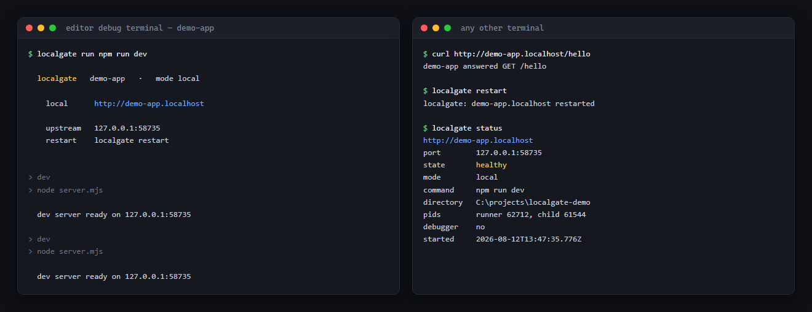
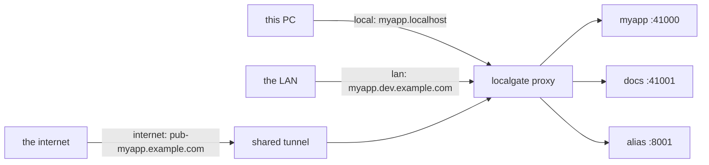
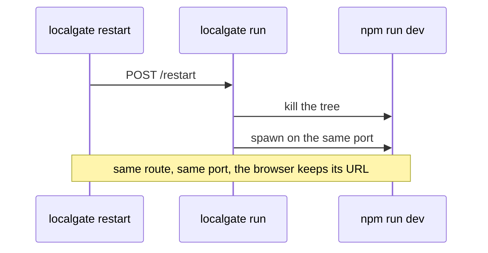

# localgate

Stable names for local dev servers.

[](https://github.com/ludekvodicka/LocalGate/actions/workflows/ci.yml)
[](LICENSE)

One reverse proxy multiplexes every dev server on the machine by `Host` header, so each app gets a name
instead of a port: `myapp.localhost` locally, optionally `myapp.<label>.<your-domain>` on the LAN,
and optionally `<public-prefix>-myapp.<your-domain>` through a tunnel.

It also owns the dev process it starts, which is the part editors cannot give you: `localgate restart`
restarts the server running inside your editor's debug terminal, without stealing the route or the
terminal, and `localgate status --json` answers where and how an app is running - the answer a coding
agent needs before it touches anything.



```bash
localgate run npm run dev     # in your editor's launch config
localgate list                # what is running
localgate restart             # restart the app in this directory
localgate status --json       # machine-readable state
```

## How it routes

Every dev server binds an ephemeral loopback port and registers its name. The proxy routes by the
`Host` header, so it is the only thing that has to listen on a fixed port.



The tunnel is not localgate's. It is whatever you already run, pointed at this machine's LAN address
on the proxy's port. It keeps the `Host` header, so a request arriving through it is routed like a LAN
request. Localgate only needs the public prefix to register the exact public name.

The table lives in the proxy's memory. There is no config file listing apps, no port assignment to keep
in sync, and nothing to clean up after a crash.

## How restart works

The runner sits in your editor's debug terminal and owns the dev server as its child. That is what lets
a restart keep the terminal and debugger while swapping the process underneath. The restart also
reloads `package.json` and the machine config, then updates the route names before the new child starts.

With no argument, `localgate restart` asks the proxy which route owns the current directory, and posts
to that runner's own control endpoint, which listens on loopback and nowhere else.



While the dev server is down the proxy answers with a readable page instead of a connection error.
Websocket upgrades are proxied, and on Next.js dev endpoints (`/_next/*`, `/__nextjs*`) the `Origin`
and `Referer` headers are mapped back to the route's `.localhost` name. The rewrite requires the header
hostname to equal the incoming `Host`, so it works for LAN and public names without accepting a foreign
origin or requiring an `allowedDevOrigins` entry in the project.

## Install

Node 24+.

```bash
npm install -g localgate
```

On Windows the proxy binds port 80, so a name stands alone: `http://myapp.localhost`. On Linux and
macOS everything below 1024 belongs to root, and a tool that starts itself on demand has no business
asking for that, so it binds **8080** and the port rides along: `http://myapp.localhost:8080`. Every
URL localgate prints already carries it. To have 80 there too, give the node binary the capability
(`sudo setcap cap_net_bind_service=+ep $(which node)` on Linux) and set `"proxyPort": 80` in
`~/.localgate/config.json`.

Or from a clone, which is also how you develop on it:

```bash
git clone https://github.com/ludekvodicka/LocalGate.git
cd LocalGate
pnpm install
pnpm link --global      # puts `localgate` on your PATH
```

Then, in your editor's launch configuration, run the dev server through it:

```jsonc
// .vscode/launch.json
{
  "name": "dev",
  "type": "node-terminal",
  "request": "launch",
  "command": "localgate run npm run dev"
}
```

The debugger attaches to the child as usual, and the terminal stays where it is across a restart.

### Starting it again while it is already running

Press the editor's restart button and you start a *second* `localgate run` for the same project, which
used to fail twice over: the name moved to the new runner and left the old one unreachable, and the
dev server then refused the port because of its own lock. So the collision is settled before anything
is claimed - the new run finds its predecessor and asks, in the debug terminal it was started from:

```
  localgate   myapp.localhost is already running

    command    npm run dev
    upstream   127.0.0.1:54382
    started    2026-08-12 09:04:11
    pids       runner 45568, child 4544
    debugger   attached

Stop it and take over? [Y/n]
```

Yes stops the old one the good way: its own runner kills the child tree, releases the port and
deregisters itself, so its terminal ends cleanly and the new run takes the name. Killing by pid is
only the fallback for a runner that no longer answers.

A route whose runner is already gone is not a question. Its dev server usually outlived it and still
holds the port - that is the orphan a framework lock trips over - so it is cleared and the name reused
without asking.

## Commands

| Command | What it does |
|---|---|
| `localgate run [--force] <cmd...>` | Run a dev server behind its name. `--force` takes over a running one without asking. |
| `localgate list [--json]` | Show active routes. |
| `localgate status [app] [--json]` | State of one route, with a tail of its output in `--json`. |
| `localgate restart [app]` | Restart a route's dev server. |
| `localgate stop [app]` | Stop a route's dev server. |
| `localgate logs [app] [--lines N]` | Tail a route's captured output. |
| `localgate alias <name> <port>` | Register a static route, e.g. a docker service. |
| `localgate cloudflare-info` | Print the DNS and ingress entries to paste. |
| `localgate prune` | Drop routes whose runner is gone. |

With no `[app]` argument, a command acts on the route owning the current directory.

## Working with a coding agent

An agent editing your project has a directory and no idea what is running in it. These three answer
that without it having to find, read or guess a port:

```bash
localgate status --json     # state, port, command, pids, whether a debugger is attached, log tail
localgate restart           # restart this project's dev server, keeping its name and port
localgate list --json       # everything running on the machine
```

`status --json` includes the last lines the dev server printed, so an agent can check whether its
change compiled without owning the terminal it compiled in.

The takeover question above is the one place this matters for safety. **With no terminal to ask in -
an agent, a CI job - `localgate run` prints what is already running and exits 1 instead of asking.**
It never kills the developer's session by accident; `localgate run --force` takes over deliberately.

## Names, and who can reach them

A project gets its name from `package.json`, and nothing else is needed to work locally:

| Mode | Names | Reachable from |
|---|---|---|
| `local` (default) | `myapp.localhost` | this machine |
| `lan` | + `myapp.<label>.<your-domain>` | any PC on the LAN that resolves your domain |
| `internet` | + `<public-prefix>-myapp.<your-domain>` | local machine, LAN and the configured tunnel |

The name is the package name, with a scope dropped (`@org/web` becomes `web`), and it has to be a
usable hostname label. When the package name is long or is not what you want to type, override it -
that plus the mode is everything a repository ever carries:

```jsonc
// package.json
{
  "name": "@acme/myapp-frontend",
  "localgate": {
    "mode": "lan",       // local (default) | lan | internet
    "name": "myapp"      // optional: the hostname label, instead of the package name
  }
}
```

Everything machine-specific stays out of the repository, in `~/.localgate/config.json`. This is where
your own domain is configured, and it is per machine, so two developers can serve the same project on
their own names without either name being in the repository:

```jsonc
{
  "label": "dev",              // your machine, as a DNS label
  "baseDomain": "example.com", // a domain whose wildcard resolves to this LAN
  "lanIp": "192.0.2.10",       // the address the proxy also listens on
  "publicPrefix": "pub",        // prefix owned by this machine on the public domain
  "autoRestart": false         // see "When a dev server stops answering"
}
```

With that file present, `myapp` in mode `lan` also answers on `myapp.dev.example.com`, while mode
`internet` additionally answers on `pub-myapp.example.com`. Browser-facing
environment variables (`NEXT_PUBLIC_*`, `*_PUBLIC_URL`, `AUTH_URL`, `NEXTAUTH_URL`) are rewritten from
`.localhost` to the name selected by the current mode on the way into the dev server. Public URLs use
HTTPS and never carry the proxy's internal LAN port. Server-side variables stay on `.localhost`.

For reaching an app from outside the LAN, `localgate cloudflare-info` prints the exact prefixed DNS
record and tunnel ingress entry. It prints them and stops: localgate holds no API token and sends
nothing anywhere. In Atomix projects, use `axtoolsv2 expose <dir> off|network|internet`; AtomixToolsV2
owns the API calls, project state, and Localgate reload. It retains an existing managed CNAME when
leaving `internet` and removes only ingress, so the public hostname reaches the tunnel's 404 catch-all
without DNS recreation delay. Anyone holding an enabled public URL reaches the dev server, which is why
`internet` is a mode you switch back from.

## When a dev server stops answering

Detection is free: the proxy forwards every request anyway, so it sees the answer that never came. You
get a readable page instead of a browser error, and it says what to do next:

| State | What the browser gets |
|---|---|
| `starting` | 503, "still starting, reload in a moment" - a refused connection right after launch is normal |
| `dead` | 503, "nothing is listening" plus the `prune` hint - the route outlived its dev server |
| `unresponsive` | 504, after three requests in a row went unanswered, with the exact `localgate restart` line to run |

Acting on it is the risky half, so it is opt-in: `"autoRestart": true` in `~/.localgate/config.json`
lets the proxy restart an unresponsive app by itself, bounded by two attempts and a five-minute
cooldown. **It never fires while a debugger is attached** - a process paused at a breakpoint is
externally indistinguishable from a wedged one, and killing it would destroy the session you are
standing in. Reporting always happens; only the restart is behind the switch.

If the proxy itself dies, every running app notices within ten seconds and re-registers its route, so
the names come back without touching a single dev server.

## Design rules

- **Nothing machine-specific is committed.** The label, public prefix, domain and LAN IP live in
  `~/.localgate/config.json`; a repository carries at most a `package.json` key holding a mode
  (`local` / `lan` / `internet`) and an optional name. Absent key means `local`, which is names on
  `.localhost` only.
- **Nothing is persisted.** The route table is live state; after a reboot nothing runs until the first
  command. Aliases are part of that: `localgate alias` has to be re-run after the proxy exits.
- **The proxy is not a service.** The first `run` or `alias` starts it, and it exits once the last route
  disappears.
- **No TLS, no tunnels of its own.** Plain http; put Cloudflare in front when something must be reachable
  from the internet.

## Security

The control API - register, restart, stop, enumerate - is served **only on the loopback listener**, and
each runner's restart endpoint listens on `127.0.0.1` alone. Nothing on the LAN can register a route or
restart a process.

The mode is enforced by the listener, not just by which names exist. A `.localhost` name means "the
machine that resolved it", so the LAN listener never answers one, whatever `Host` header a request
carries and whether it is a plain request or a websocket upgrade. An app in the default `local` mode
has no other name, which is what keeps it on this machine.

Those dev servers are the real exposure: in `lan` mode anyone on the network reaches them with no
authentication, and in `internet` mode anyone holding the URL does. Use `lan` on networks you trust, and
switch back from `internet` when you are done. There is no TLS - it is plain http by design.

## Development

```bash
pnpm run verify      # type-check + lint + tests
pnpm test            # vitest
```

The CLI runs the TypeScript sources directly through tsx, so a working copy is always runnable with no
build step.

## Status

Early. Windows, Linux and macOS: the kill that makes `restart` reliable goes through `taskkill /T` on
Windows and the child's process group elsewhere, and the port-holder lookup is PowerShell or `lsof`.

One rough edge on macOS: browsers resolve `*.localhost` to loopback by RFC 6761, but the system
resolver does not, so `curl http://myapp.localhost:8080` and server-to-server calls by name need an
`/etc/hosts` entry there. Browsers are fine.

Bug reports and ideas are welcome - see [CONTRIBUTING.md](CONTRIBUTING.md), and
[SECURITY.md](SECURITY.md) for anything security-related. Licensed under
[Apache-2.0](LICENSE).
